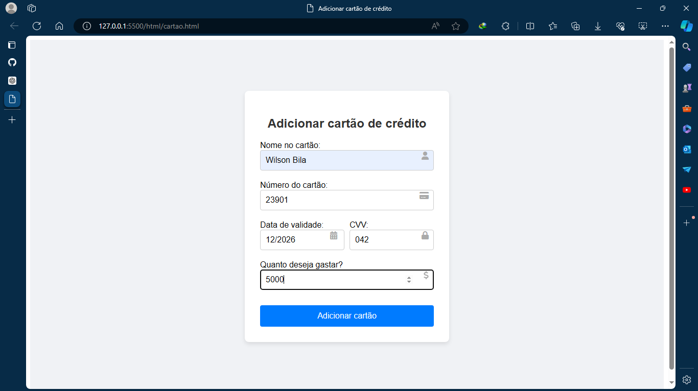
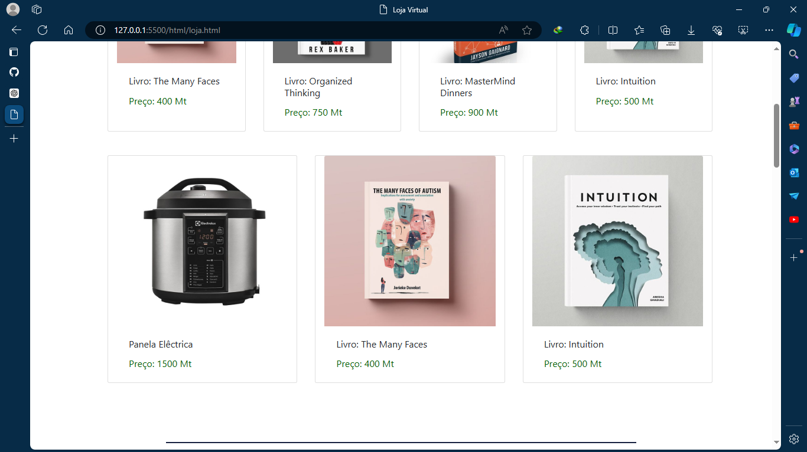
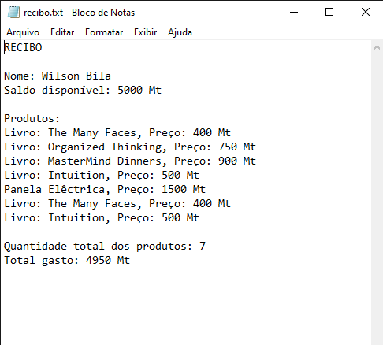

<h1>This is a Web System about Automatic buying and selling system built with HTML5, CSS3, and JavaScript. And an AI has been developed</h1>
 
We here used HTML5, CSS3, BootStrap, Tailwind and JavaScript.
 
Here we use four types of Artificial Intelligence agents: Reactive, Cognitive, Environmental, and Goal-Oriented agents. Initially, we enter the card details and define the amount we intend to spend on purchases. 
 
The AI then provides us with a suggested list of products that reach the spending limit according to the entered balance.
 
In the end, it generates a receipt with all the information of the automatic purchase.

<h1>Adding the card data:</h1> 

<h1>List of suggested products and Total amount spent on purchases:</h1> 

<h1>Suggested products part 2:</h1> 

<h1>Purchase confirmation:</h1> 

<h1>Purchase receipt:</h1> 

<h1>Some products from the store:</h1> 

<h1>Some products from the store part 2:</h1> 

